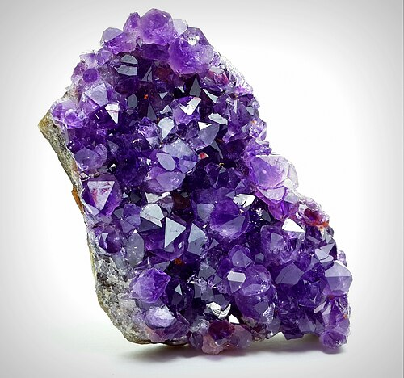

# Ametyst / Amethyst

**Souhrn**: Fialová odrůda křemene (SiO₂) zbarvená Fe³⁺ a přírodním zářením. V České republice pocházejí klasické nálezy z melafyrových dutin Kozákova, Rašovky a Šimonovic a jako doprovodný minerál ze železnorudných žil Krušných hor („ametystově zbarvené halže").
**Zdroje**: en.wikipedia.org/wiki/Amethyst, peltramminerals.com/en/czech-agates, visitczechia.com
**Poslední aktualizace**: 2026-05-09

---

*Ametyst (obecný snímek druhu) — Wikimedia Commons (CC)*

## Lokality (ČR)
- **Rašovka, Šimonovice** (Liberecko) — historicky proslulé ametystové drúzy v melafyrových dutinách.
- **Kozákovský hřbet** / Český ráj — doprovází achát, jaspis a chalcedon v mandlovci.
- **Krušnohorské železnorudné žíly** — „ametystově zbarvené halže" (např. revír Halže). Vzniká v dutinách žil vedle pseudomorfóz achátu po barytu/kalcitu.
- **Český ráj obecně** — VisitCzechia jej řadí mezi „olivín, achát, jaspis, křišťál, ametyst, chalcedon" jako drahokamy regionu.

## Geologické prostředí
Hydrotermální vznik — typický český ametyst roste (a) v plynných dutinách permokarbonských melafyrových láv, často jako poslední výplň nad páskováním achátu, a (b) v rudních hydrotermálních žilách Krušných hor, kde doprovází baryt, kalcit a železné zrudnění. Fialovou barvu způsobují **Fe⁴⁺ barevná centra** vznikající ozářením stopových Fe³⁺ příměsí přírodním ionizujícím zářením; zahříváním se centra rozpadají a kámen mění barvu ve žlutou (citrín) nebo bezbarvou.

## Vzácnost
**Lokálně hojný** — české ametysty co do velikosti nepatří ke světové třídě (srov. Brazílie), jsou však ikonickou součástí mineralogických asociací Českého ráje a oblíbeným sběratelským druhem. Kvalitní drúzy z Rašovky a Šimonovic jsou vyhledávané.

## Popis
Trigonální SiO₂, tvrdost 7, skelný lesk, lasturnatý lom, charakteristická fialová barva — od světle lila po sytou purpurovou. Často tvoří zonálně zbarvené krystaly, žezlové habity nebo „čepicový" ametyst na mléčně bílém křemenném prizmatu. České kusy bývají skromnějších rozměrů (centimetrový řád), ale dobře vyvinuté, často s typickou „mandlovcovou" kůrou hostitelské lávy. Tepelně upravený materiál odjinud se prodává jako „citrín" — přírodní český ametyst zůstává regionálním kulturním symbolem vedle granátu a vltavínu.

## Zdroje
- [Ametyst — Wikipedie](https://en.wikipedia.org/wiki/Amethyst) — (zdroj: wikipedia-en)
- [České acháty / krušnohorské žíly — Peltram Minerals](https://www.peltramminerals.com/en/czech-agates/) — (zdroj: peltram)
- [České granáty / drahokamy Českého ráje — VisitCzechia](https://www.visitczechia.com/en-us/things-to-do/places/culture/traditional-crafts/c-czech-garnets-stonecutting) — (zdroj: visitczechia)

## Související stránky
[[Index]] [[Achat]] [[Kozakov]]
