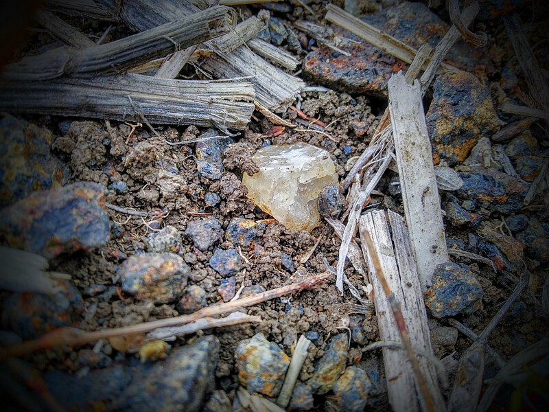
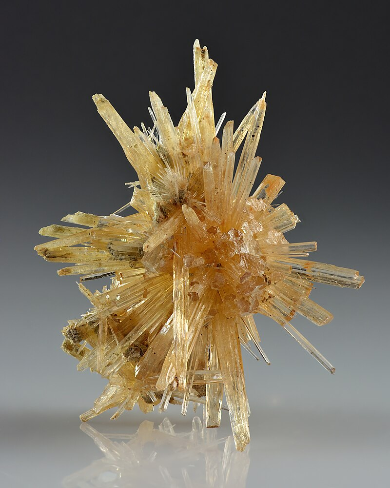

# Aragonit / Aragonite

**Souhrn**: Aragonit je rombický polymorf uhličitanu vápenatého (CaCO₃), pojmenovaný roku 1797 podle španělské lokality Molina de Aragón. V ČR má několik klasických lokalit, mezi nimi sběratelsky proslavený Číčov u Hořence (NPR) a unikátní Zbrašovské aragonitové jeskyně u Hranic na Moravě.
**Zdroje**: cs.wikipedia.org/wiki/Aragonit, en.wikipedia.org/wiki/Aragonite
**Poslední aktualizace**: 2026-05-09

---

*Krystal aragonitu z polního sběru u PR Číčov (Hořenec, Bílinsko) / Wikimedia Commons (CC BY-SA).*

*Pseudohexagonální dvojčatné krystaly aragonitu — Pantoja, Castilla-La Mancha, Španělsko (typový region) / Wikimedia Commons (CC).*

## Lokality (ČR)
- **Hořenec u Bíliny / PR Číčov** (České středohoří) — chráněná přírodní rezervace s aragonitovými agregáty v dutinách čediče. Klasická česká aragonitová lokalita.
- **Hřídelec u Nové Paky** (Podkrkonoší) — krystaly v melafyrových mandlovcích.
- **Valeč v Doupovských horách** — společně s [[Hyalit|hyalitem]] v doupovských vulkanitech.
- **Všechlapy** (Teplicko).
- **Hranice na Moravě — Zbrašovské aragonitové jeskyně** — unikátní hypogenní jeskyně tvořené teplými mineralizovanými vodami z hloubky, s aragonitovými „ježky" a sintry. Jediný výskyt tohoto typu v ČR.
- **Příbram** — sekundární aragonit v některých rudních důlních systémech.

## Geologické prostředí
Aragonit je nízkoteplotní, připovrchový minerál. V ČR vzniká nejčastěji **autohydratací bazaltů a melafyrů** (Číčov, Hřídelec, Valeč) — vápenaté roztoky pomalu prosakují a krystalizují v dutinách lávových mandlovců. Druhý typický typ je **hypogenní krasový aragonit** (Zbrašovské aragonitové jeskyně) — vysrážený z teplých uhličitých vod proudících z hloubky vzhůru. Další možný vznik: hydrotermální žíly (Příbram), termální prameny.

Aragonit je termodynamicky metastabilní za běžných podmínek na povrchu Země, postupně se mění na **kalcit** (na škále 10⁷–10⁸ let). Přítomnost iontů Mg²⁺, Sr²⁺ nebo Pb²⁺ jeho stabilitu prodlužuje — proto je častý ve schránkách měkkýšů a v korálech.

## Vzácnost
**Lokálně hojný** v ČR — Číčov, Hřídelec a Zbrašovské jeskyně produkují sbírkové exempláře. Krystalograficky čisté pseudohexagonální dvojčatné srůsty (typ Molina de Aragón) z českých lokalit jsou méně časté.

## Popis
Bezvodý uhličitan vápenatý (CaCO₃, Ca 40 %, C 12 %, O 48 %) ve **rombické soustavě** (na rozdíl od trigonálního kalcitu). Tvrdost 3,5–4 (Mohs), hustota 2,94 g/cm³, lesk skelný, lasturnatý lom, štěpnost zřetelná podle {010}. Barva bílá, šedá, žlutavá, modravá, někdy bezbarvý. Krystaly jsou krátce nebo dlouze prismatické, často **pseudohexagonální** díky častému dvojčatění podle [110]. Tvoří také vláknité, sloupcovité, hrachovcovité (pizolitické), vřídlovcové („vřídlovec" z karlovarských termálních pramenů) a flos-ferri („železné květy") agregáty. Přechod na kalcit nastává nad 400 °C. Charakteristické odrůdy: **mossottit** (Sr), **nicholsonit** (Zn), **tarnowicit** (Pb), **vřídlovec**, **hrachovec**, **onyxový mramor**, **amolit** (duhový aragonit z amonitů, šperkařsky využívaný).

V ČR má aragonit i **kulturní stopu** — podsvícený onyxový mramor (řezy aragonitu) byl použit jako dekorativní stěna ve **Vile Tugendhat** v Brně.

## Zdroje
- [Aragonit — česká Wikipedie](https://cs.wikipedia.org/wiki/Aragonit) — (zdroj: wikipedia-cs)
- [Aragonite — Wikipedia](https://en.wikipedia.org/wiki/Aragonite) — (zdroj: wikipedia-en)

## Související stránky
[[Hyalit]] [[Index]]
