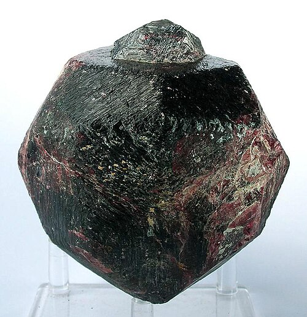

# Český granát / Bohemian garnet (pyrop)

**Souhrn**: Ohnivě červený pyrop bohatý na chrom, mineralogický symbol Českého království. Těží se v Českém středohoří od 16. století, brousí a osazuje se ve šperkařských dílnách Turnovska a od dob Marie Terezie byl chráněn vývozním zákazem.
**Zdroje**: gia.edu/red-pyrope-garnets-bohemia-reading-list, visitczechia.com czech-garnets-stonecutting
**Poslední aktualizace**: 2026-05-09

---

*Pyrop (obecný snímek druhu) — Wikimedia Commons (CC)*

## Lokality (ČR)
- **České středohoří** — hlavní historický i současný zdroj, ~60 km severozápadně od Prahy. Měrunice (něm. Meronitz) a okolní obce jsou klasickými lokalitami 18. a 19. století.
- **Podkrkonoší** — drobné výskyty.
- **Kolínsko** — drobné výskyty.
- Stovky drobných pyropových lokalit roztroušených po Čechách.
- **Turnov** — není ložiskem, ale historickým centrem broušení, leštění a šperkařství; tradice sahá až k prospektorům Rudolfa II.

## Geologické prostředí
Cr-pyrop, chromem bohatá odrůda krajního členu pyropu Mg₃Al₂(SiO₄)₃. Zdrojovou horninou je plášťový peridotit (dnes přeměněný na serpentinit) vynesený na povrch terciérními sopečnými erupcemi a uzavřený v sopečné brekcii. Krystaly — typicky do ~6 mm — se z navětralé brekcie uvolňují a sbírají z kvartérních aluviálních sedimentů praním; svislé šachty se historicky používaly k přístupu k pyropoví brekcii in situ.

## Vzácnost
**Lokálně hojný, kvalitou ovšem světová třída** — sytě červená barva a čistota českého pyropu nemají na trhu obdoby. Africké, brazilské a indické almandiny i rodolity se mu sice podobají, ale prodávají se zhruba o řád levněji.

## Popis
Pyrop je průhledný ohnivě červený horčíkohlinitý křemičitan, barevně stálý, žáru- a kyselinovzdorný, tvrdosti 7–7,5. Česká odrůda je proslulá obsahem chromu, který jí dodává charakteristickou hlubokou krvavě červenou barvu. Surové kameny mívají do 8 mm a brousí se na ~4 mm — větší kusy jsou výjimečné a historicky podléhaly císařskému předkupnímu právu. Druh poprvé popsal Georgius Agricola v *De Natura Fossilium* (1546); chemické rozbory Acharda (1778), Klaprotha (1797) a dalších v průběhu 19. století jej etablovaly jako samostatný druh. České granáty byly tak módní, že Marie Terezie roku 1762 omezila jejich vývoz (regulační patent), aby ochránila domácí monopol — v lidové tradici se ten zásah šíří jako úplný „zákaz vývozu", primární prameny ale spíš dokládají regulaci a clo. Turnov se stal centrem broušení — Bratrstvo svobodného umění kamenořezného (Steinschneider), Odborná uměleckoprůmyslová škola založená 1884 i dodnes činné družstvo Granát Turnov mají kořeny v této tradici. Muzeum Českého ráje v Turnově a Muzeum drahých kamenů u Kozákova řemeslo prezentují.

## Zdroje
- [Historical Reading List: Red Pyrope Garnets from Bohemia — GIA](https://www.gia.edu/red-pyrope-garnets-bohemia-reading-list) — (zdroj: gia)
- [České granáty: od broušení ke šperku — VisitCzechia](https://www.visitczechia.com/en-us/things-to-do/places/culture/traditional-crafts/c-czech-garnets-stonecutting) — (zdroj: visitczechia)

## Související stránky
[[Index]] [[Vltavin]] [[Kozakov]]
