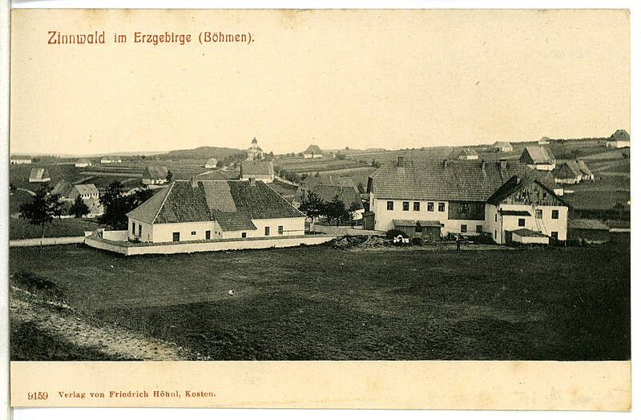

# Cínovec / Zinnwald — Sn-W-Li revír

**Souhrn**: Hornická osada v Krušných horách (část města Dubí, okres Teplice), historicky jeden z nejvýznamnějších cínonosných revírů Evropy a typová lokalita cinvalditu (Zinnwaldit). Dnes Cínovec drží zhruba 6 % světových známých zdrojů lithia, vázaného na zdejší cinvalditové žíly.
**Zdroje**: cs.wikipedia.org/wiki/Cínovec_(Dubí)
**Poslední aktualizace**: 2026-05-09

---

*Cínovec na pohlednici z roku 1907 (Brück & Sohn Kunstverlag). Zdroj: Wikimedia Commons (public domain).*

## Lokalita
- **Cínovec (část Dubí)** — Krušné hory, okres Teplice, na česko-saské hranici. Druhá polovina osady leží na německé straně jako Zinnwald-Georgenfeld (město Altenberg). Hranice stanovená Chebskou smlouvou 1459 dělí stejné rudní pole na dva státy.

## Geologické zasazení
Cínovec leží nad krušnohorským granitovým plutonem (cínovecký granit), do jehož apikální části (vrcholová granitová kupole) jsou vázány hydrotermálně-pneumatolytické žíly s **kasiteritem** (cín), **wolframitem** (wolfram) a slídami **cinvalditu** (Li-biotit, lithium). Kromě toho doprovodně topaz, fluorit a křemen. Cinvaldit je trioktaedrická slída s podstatným podílem lithia — v cínoveckých žílách tvoří hlavní hostitelský minerál Li.

## Vzácnost
Cínovec je **typová lokalita cinvalditu** (popsán odsud, něm. název podle Zinnwaldu). Sn-W rudy zde patřily ke světově významným, lithium z žil cinvalditu představuje světově relevantní rezervu (1,2–1,4 mil. tun obsahu Li, ~6 % světových známých zdrojů, 90 % zásob v ČR). Kovnatost je nízká (~0,2 % Li), takže ve světovém pojetí nejde o klasické zásoby, ale o zdroje s nižší ekonomickou ověřeností.

## Popis
První písemná zmínka o Cínovci je z roku **1378**, ale dolování cínu sahá dál — horníci sem pronikali z nedaleké Krupky už ve 12. století. Od poloviny 15. století těžba sílila a Cínovec se stal konkurencí mateřské Krupky, status hornického města mu byl udělen 1885. Po krátkém útlumu během třicetileté války se těžba obnovila a (s výkyvy) pokračovala až do 20. století; po roce 1945 spadal důl pod n. p. Rudné doly Příbram. **Konec těžby cín-wolframových rud nastal roku 1990**, čímž Cínovec definitivně přestal být fungující hornickou obcí. Po roce 2014 zde zahájila společnost Geomet (ve spojení s australskou European Metals) průzkum lithia, k zahájení těžby ale zatím nedošlo (k 2025 stále jen průzkumný stav).

## Klíčové minerály
- **Kasiterit** (Sn) — viz [[Kasiterit]]
- **Cinvaldit** (Li-slída) — typová lokalita, viz [[Cinvaldit]]
- **Wolframit** ((Fe,Mn)WO₄)
- **Záhněda / morion** (vedlejší výskyt — viz [[Zahneda]])
- topaz, fluorit, křemen, arzenopyrit

## Zdroje
- [Cínovec (Dubí) — Wikipedie](https://cs.wikipedia.org/wiki/C%C3%ADnovec_(Dub%C3%AD)) — (source: cs-wiki)

## Související stránky
[[Kasiterit]] [[Cinvaldit]] [[JachymovskeRudy]] [[Index]]
