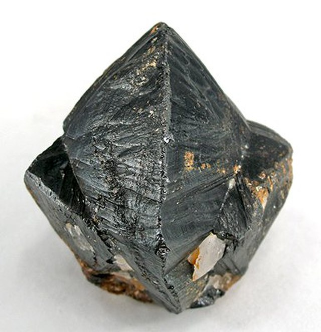

# Horní Slavkov / Schlaggenwald — cín-wolframový revír

**Souhrn**: Královské horní město ve Slavkovském lese, v 16. století **největší producent cínu na světě**. Spolu s Krásnem a Litrbachy tvořilo trojměstí cínového revíru. Dobývaly se zde také stříbro, wolfram a po roce 1945 uran. Klasická lokalita pro kasiteritové druzy a topaz.
**Zdroje**: cs.wikipedia.org/wiki/Horní_Slavkov
**Poslední aktualizace**: 2026-05-09

---

*Krystal kasiteritu z Horního Slavkova. Zdroj: Wikimedia Commons (Cassiterite-hc3b.jpg, CC).*

## Lokalita
- **Horní Slavkov** (něm. Schlaggenwald) — okres Sokolov, Karlovarský kraj, Slavkovský les. Spolu s Krásnem a Litrbachy historické trojměstí cínového revíru. Hubský peň byl hlavním ložiskem cínu v celém revíru.

## Geologické zasazení
Cín-wolframové zrudnění je vázáno na hydrotermální greisenizovaná tělesa kolem apikální části granitového masivu Slavkovského lesa (karlovarský pluton). Hlavními žíly hostily kasiterit (cínovec) a wolframit; doprovodně topaz, fluorit, apatit, slídy, později i uranová mineralizace. Pegmatitové akcesorické minerály jsou v širším okolí běžné.

## Vzácnost
Klasická **světoznámá** Sn-W lokalita — kasiteritové krystaly z Horního Slavkova jsou ve sbírkách předních mineralogických muzeí. Topaz "Schlaggenwaldský" je historický termín pro místní druzy. Po Cínovci a Krupce je Horní Slavkov třetí pilíř krušnohorsko-slavkovské cínové provincie. Uranová těžba (po 1945) přidala radioaktivní mineralizaci.

## Popis
První písemná zmínka 1332. Město založeno kolem 1355 Slávkem z Rýzmburka. Od roku 1526 zde byla mincovna (pravděpodobně se zde razily i jáchymovské tolary). Pluhové z Rabštejna (Sebastian, Jan, Kašpar) v 16. století masivně rozvinuli těžbu — Horní Slavkov se stal **největším producentem cínu na světě**, kolem 1533 měl ~4 000 měšťanů a v okolí žilo až 6 000 havířů (mezi pěticí největších měst Českého království). Bohatství vyústilo v renesanční městské centrum a unikátní 24 km dlouhý vodní kanál **Dlouhá stoka**, přivádějící vodu z rašelinišť u Kladské pro důlní pohony. Po Šmalkaldské válce 1547 panství zkonfiskováno, město povýšeno na královské horní. Konec 16. století přinesl pokles cínu, třicetiletá válka konfiskace a odchod báňských specialistů. Hubský peň byl koncem 18. století opuštěn. Těžba wolframu a cínu obnovena za 2. svět. války (1941); po 1945 nasazena těžba **uranu** (pozůstatky dolu Svatopluk dosud na okraji města).

## Klíčové minerály
- **Kasiterit** — krystaly i druzy, viz [[Kasiterit]]
- **Wolframit** ((Fe,Mn)WO₄)
- **Topaz** — historicky uváděný pod názvem "Schlaggenwaldský topaz"
- **Apatit, fluorit, slídy** — doprovodná greisenová parageneze
- **Uranové minerály** (po 1945, důl Svatopluk) — uraninit, jeho oxidace

## Zdroje
- [Horní Slavkov — Wikipedie](https://cs.wikipedia.org/wiki/Horn%C3%AD_Slavkov) — (source: cs-wiki)

## Související stránky
[[Kasiterit]] [[Cinovec]] [[JachymovskeRudy]] [[Index]]
