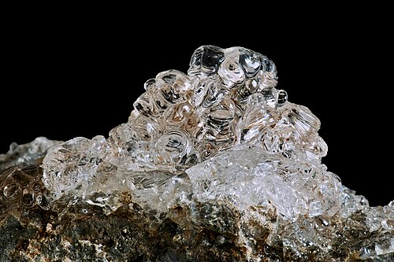

# Hyalit / Hyalite (Müllerovo sklo)

**Souhrn**: Průhledná, sklovitá, bezbarvá odrůda opálu, která pod UV zářením jasně zeleně fluoreskuje díky stopovému uranu. Lokalita Valeč v Doupovských horách patří ke světovým klasickým nalezištím 19. století.
**Zdroje**: en.wikipedia.org/wiki/Hyalite
**Poslední aktualizace**: 2026-05-09

---

*Hyalit z Valče — Wikimedia Commons (CC)*

## Lokality (ČR)
- **Valeč** (Doupovské hory, Karlovarský kraj) — **světová typová lokalita**. Hyalit se zde sbírá od počátku 19. století; valečské vzorky jsou v největších muzejních sbírkách světa.
- Další drobné české výskyty ve vulkanických / pegmatitových horninách severozápadních Čech.

## Geologické prostředí
**Vulkanický sublimát** — hyalit vzniká jako nízkoteplotní výpotek SiO₂ z plynné fáze v dutinách a puklinách vulkanických a pegmatitových hornin. Ve Valči pokrývá dutiny a pukliny v alkalicko-čedičových horninách doupovského vulkanického komplexu.

## Vzácnost
**Světová třída** ve Valči — referenční lokalita druhu v evropské mineralogické literatuře. Ostatní české nálezy jsou drobné.

## Popis
Amorfní SiO₂ s 3–8 % vody (silanol nebo molekulární), klasifikovaný jako **mineraloid** (bez krystalové struktury). Tvrdost 5,5–6, měrná hmotnost 1,9–2,1, lasturnatý lom, skelný lesk, bílý vryp. Tvoří bezbarvé až slabě modravé sklovité kuličky a hroznovité krusty — povrch vypadá jako kapky čirého laku. Rozlišovací znak: **jasně jablečně zelená fluorescence v krátkovlnném UV** vyvolaná stopovým uranem (uranylový ion). Vlastní jméno **„hyalit"** zavedl A. G. Werner z řeckého *hyalos* = sklo. Alternativní označení **„Müllerovo sklo"** (Müller's glass) je pojmenováno po objeviteli druhu Franzi-Josephu Müllerovi von Reichenstein, který materiál popsal z Valče. Další synonyma: vodní opál, jalit. Používá se jako sběratelský drahokam a je oblíbený mezi sběrateli fluorescenčních minerálů — valečský vzorek pod UV lampou patří k nejfotogeničtějším exemplářům v mineralogii.

## Zdroje
- [Hyalit — Wikipedie](https://en.wikipedia.org/wiki/Hyalite) — (zdroj: wikipedia-en)

## Související stránky
[[Index]] [[Vltavin]]
