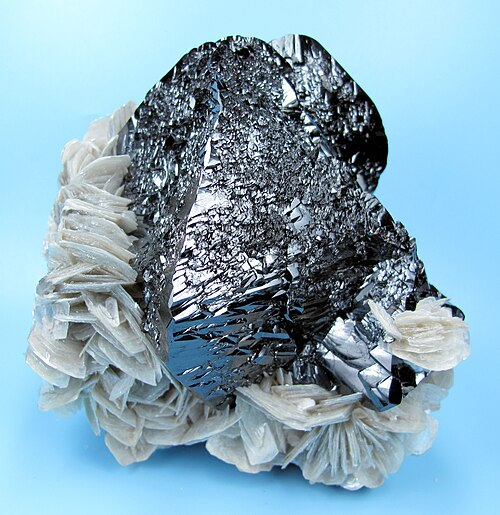

# Kasiterit / Cassiterite (cínovec)

**Souhrn**: SnO₂, hlavní ruda cínu. Klasickou českou lokalitou je Cínovec (Zinnwald) v Krušných horách, těžený na cín od roku 1378 a opětovně až do roku 1990. Cínovec je rovněž typovou lokalitou cinvalditu (zinnwalditu, 1845) a stolzitu (1845).
**Zdroje**: en.wikipedia.org/wiki/Cassiterite, 21stoleti.cz, en.wikipedia.org/wiki/Zinnwaldite
**Poslední aktualizace**: 2026-05-09

---

*Vzorek kasiteritu — Wikimedia Commons (CC)*

## Lokality (ČR)
- **Cínovec / Zinnwald** (Krušné hory, okres Teplice, na hranici s Německem) — historické srdce české těžby cínu. Cín (kasiterit), wolfram (wolframit, scheelit) i lithium (cinvaldit, lepidolit) pocházejí z téhož greisenového systému. Těžba poprvé doložena 1378, poslední kampaň ukončena 1990 v dole Cínovec-jih. Typová lokalita **cinvalditu / zinnwalditu** (pojmenován 1845) a **stolzitu** (PbWO₄, popsán 1820 Breithauptem, pojmenován 1845 Haidingerem po J. A. Stolzovi z Teplic).
- **Horní Slavkov / Krásno** (severozápadní Čechy, okres Karlovy Vary) — druhý velký český cínovo-wolframový revír, těžený od 10. století. Poslední činný důl (Stannum) ukončen 1991. Mineralogicky velmi bohatý: kasiterit, wolframit, scheelit, arzenopyrit, sfalerit, chalkopyrit, stannin, k tomu sekundární skorodit, olivenit, libethenit. Typová lokalita inosilikátu **karfolitu** (1817).

## Geologické prostředí
**Greiseny a křemenné žíly** v silně přeměněných variských granitech. Granitové kupole Cínovce a Krásna-Horního Slavkova prošly intenzivní pomagmatickou alterací F- a B-bohatými fluidy, která vytvořila greiseny (horninu křemen-topaz-slída) hostící kasiterit, wolframit a scheelit. Pegmatitové a křemenné žilní odbočky obsahují hrubý kasiterit s topazem, fluoritem, berylem, lepidolitem a cinvalditem. Tentýž revír produkuje i tradiční sulfidy (galenit, sfalerit, chalkopyrit, arzenopyrit, tennantit) a jílové minerály (dickit, kaolinit) z mladší alterace.

## Vzácnost
**Lokálně světová třída** — Cínovec patří k nejlépe prostudovaným cínovo-wolframovo-lithiovým greisenovým systémům na světě a je aktivním moderním cílem **těžby lithia** (přes cinvaldit). Pro sběratele jsou vysoce ceněné kusy wolframitu-kasiteritu-křemene z obou revírů.

## Popis
SnO₂, čtverečný, tvrdost 6–7, velmi vysoká měrná hmotnost (~7,0) — v ruce nápadně těžký. Černý, hnědý nebo červenohnědý, polokovový až diamantový lesk, často s charakteristickými „přesýpacími" srůsty (kolenovitými dvojčaty). České kasiterity se vyskytují jako krátce prizmatické krystaly v greisenu a křemeni, často s povlaky chloritu nebo topazu. Cínovecká těžební tradice je tak stará (obchod s cínem od doby bronzové), že česká i německá jména lokality (Cínovec, Zinnwald) doslovně přešla do názvu minerálního druhu (zinnwaldit). Lokalita je dnes opět strategicky významná jako primární evropský zdroj lithia.

## Zdroje
- [Cassiterite — Wikipedie](https://en.wikipedia.org/wiki/Cassiterite) — (zdroj: wikipedia-en)
- [Zinnwaldite — Wikipedie](https://en.wikipedia.org/wiki/Zinnwaldite) — (zdroj: wikipedia-en)
- [8 nejslavnějších mineralogických lokalit — 21stoleti.cz](https://21stoleti.cz/2011/06/22/8-nejslavnejsich-mineralogickych-lokalit-aneb-kam-v-cesku-za-kameny/) — (zdroj: 21stoleti)

## Související stránky
[[Index]] [[Cinvaldit]] [[JachymovskeRudy]]
