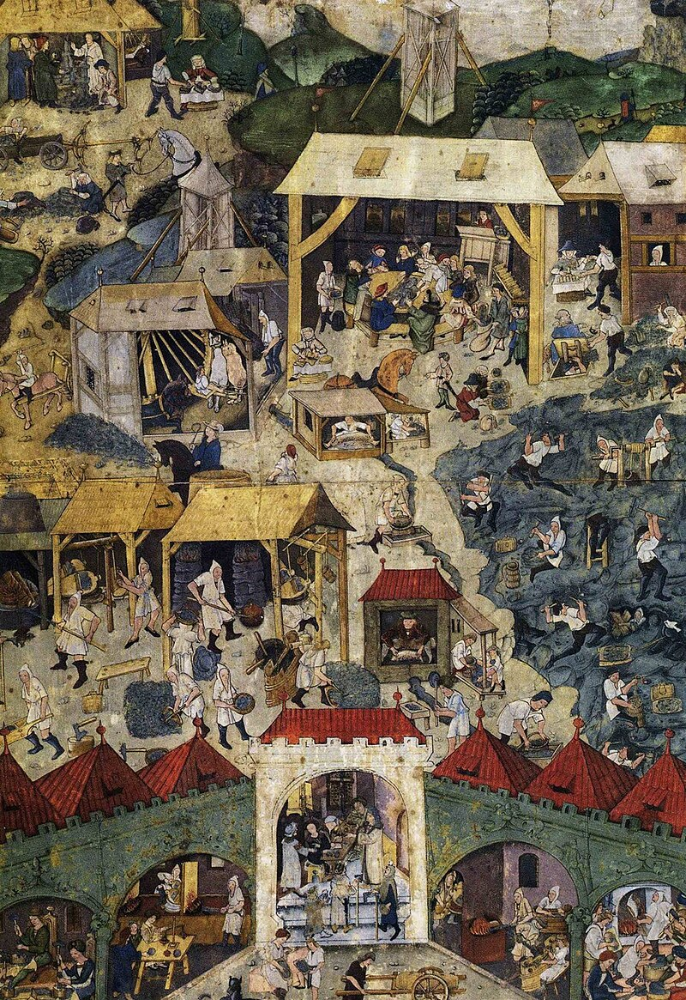

# Kutná Hora / Kuttenberg — stříbronosný revír

**Souhrn**: Středověké královské stříbrné město ve středních Čechách, hlavní finanční centrum Českého království a sídlo královské mincovny pro pražský groš. Rudy zpracovávané v okolí vrchu Kaňk obsahují galenit, sfalerit, chalkopyrit a pyrhotin spolu se stříbrem.
**Zdroje**: en.wikipedia.org/wiki/Kutná_Hora
**Poslední aktualizace**: 2026-05-09

---

*Iluminace z Kutnohorské bible (90. léta 15. století) — dobové vyobrazení těžby a zpracování stříbrné rudy / Wikimedia Commons (volné dílo).*

## Lokality (ČR)
- **Kaňk** (vrch severně od Kutné Hory) — hlavní rudní revír; doloženy keltské tavby již z 5.–1. stol. př. n. l.
- **Sedlec** — místo prvního nálezu stříbra ve 13. století u sedleckého kláštera; dnes městská část.
- **Malín** — raně středověké hradiště, nálezy stříbrných denárů z let 985–995.
- **Vlašský dvůr** (centrum města) — sídlo královské mincovny od roku 1300, ražba pražského groše až do roku 1547.
- **Hrádek** — pozdně gotický palác, dnes České muzeum stříbra se zpřístupněnou středověkou stříbrnou štolou.

## Geologické prostředí
Kutnohorský revír tvoří hydrotermální polymetalické žíly v krystaliniku kutnohorské části moldanubika. Rudní žíly nesou stříbro spolu s galenitem (PbS), sfaleritem (ZnS), chalkopyritem (CuFeS₂) a pyrhotinem (Fe₁₋ₓS) — kombinace doložená již v keltské strusce z Kaňku (cca 10 kg, 2.–1. stol. př. n. l.). V hloubce přes 500 m byly žíly v 16. století stále produktivní, ale prosakující spodní voda a klesající obsah stříbra postupně těžbu ekonomicky zlikvidovaly.

## Vzácnost
**Světová třída** (historicky). Kutná Hora patřila spolu s Jáchymovem k nejvýznamnějším evropským zdrojům stříbra ve středověku. Dnes je revír uzavřen — význam je historický a sběratelský, primární těžba neprobíhá.

## Popis
Stříbro se zde sporadicky doluje od 10. století (mince z osady Malín, 985–995), systematická těžba začíná kolem roku 1260 po nálezu rudy u sedleckého kláštera. Roku 1300 vydává Václav II. horní zákoník *Ius regale montanorum*, který stanovuje technická i správní pravidla pro celé Království české, a Kutná Hora se stává sídlem ústřední mincovny — razí se zde **pražský groš**, jedna z nejstabilnějších evropských mincí pozdního středověku. Vrchol bohatství trvá do husitských válek (1420–1424, požáry, vyhnání německé části obyvatelstva), těžba se obnovuje 1469 a definitivně končí v 18. století (mincovna uzavřena 1727). Z mineralogického hlediska je revír zajímavý kombinací stříbra s polymetalickou rudou (Pb-Zn-Cu-Fe sulfidy) a dlouhou tradicí — keltské tavící pece na Kaňku patří k nejstarším podzemním důlním stopám v Čechách. Centrum města je od roku 1995 na seznamu UNESCO.

## Zdroje
- [Kutná Hora — Wikipedia](https://en.wikipedia.org/wiki/Kutn%C3%A1_Hora) — (zdroj: wikipedia-en)

## Související stránky
[[JachymovskeRudy]] [[Pribram]] [[Index]]
