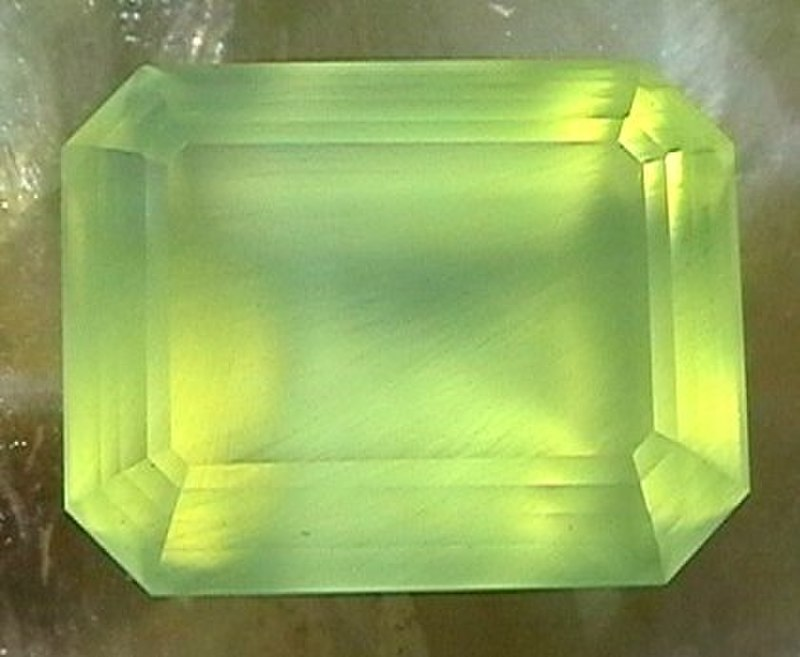
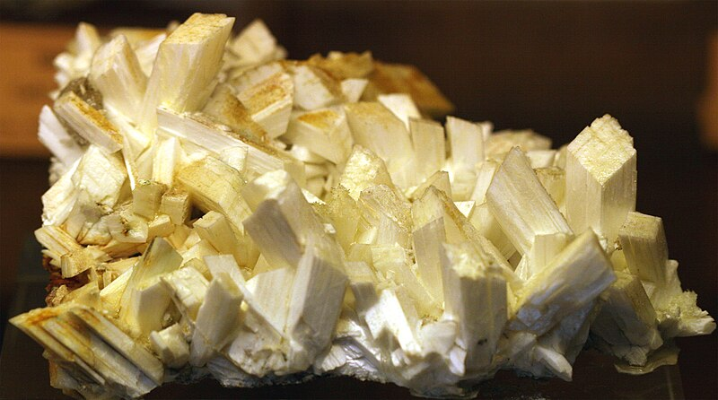
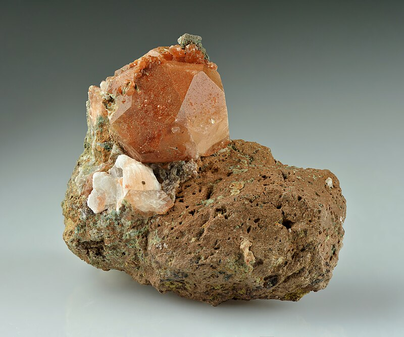

# Lom Markovice — zeolitová asociace (prehnit · laumontit · analcim)

**Souhrn**: Bývalý lom Markovice u Čáslavi je klasickou českou lokalitou pro **zeolitovou paragenezi** v dutinách bazaltových a melafyrových hornin — prehnit, laumontit a analcim spolu s kalcitem a apofylitem. Podobnou asociaci mají i další česká naleziště, zejména Studenec u Semil.
**Zdroje**: en.wikipedia.org/wiki/Prehnite, en.wikipedia.org/wiki/Laumontite, en.wikipedia.org/wiki/Analcime
**Poslední aktualizace**: 2026-05-09

---

*Prehnit ve světle zelených až bledě žlutých kulovitých agregátech / Wikimedia Commons (CC BY-SA).*

*Laumontit, narůžovělé prismatické krystaly s diamantovým průřezem / Wikimedia Commons (CC).*

*Analcim, pseudokubické (trapezohedrické) krystaly / Wikimedia Commons (CC).*

## Lokality (ČR)
- **Lom Markovice u Čáslavi** (Železné hory) — klasická lokalita pro paragenezi prehnit + laumontit + analcim v puklinách a dutinách čedičových a syenitových hornin.
- **Studenec u Semil** (Podkrkonoší) — podobná zeolitová asociace v melafyrových mandlovcích.
- **České středohoří** — řada bazaltových výskytů s analcimem a kalcitem (např. Vinařická hora, Kostomlaty).
- **Krušné hory, Železné hory** — lokálně analcim a laumontit v hydrotermálních žilách v žule a rule.

## Geologické prostředí
Zeolitová asociace **Markovic** vzniká nízkoteplotně (ca. 100–200 °C) při alteraci bazaltů, melafyrů a alkalických magmatik vodou nesoucí Ca, Na, Al a Si. Roztoky pomalu vyplňují dutiny lávových mandlovců nebo žíly v plutonitech a krystalují postupně:

1. **Prehnit** (Ca₂Al(AlSi₃O₁₀)(OH)₂) — i když není pravým zeolitem, je indikátorem **prehnit-pumpellyitové facie** nízkoteplotního metamorfismu (ca. 250–350 °C). V Markovicích tvoří kulovité, tobolkovité a stalaktitové agregáty zelené až nažloutlé barvy.
2. **Laumontit** (CaAl₂Si₄O₁₂·4H₂O) — pravý zeolit. Krystaluje monoklinicky, prismatické krystaly s kosočtvercovým průřezem. Vzniká nad ca. 100 °C, nestabilní nad 150 °C — jeho přítomnost ukazuje na intermediální diagenezi sedimentů.
3. **Analcim** (NaAlSi₂O₆·H₂O) — primární minerál v alkalických magmatitech (analcimické bazalty), nebo sekundárně v dutinách lávy. Krystaly vždy pseudokubické (nejčastěji ikositetraedr).

Doprovodné minerály v Markovicích a Studenci: **kalcit**, **apofylit**, **stilbit**, **heulandit**, **datolit**.

## Vzácnost
**Lokálně hojná**. Markovice byly v 19.–20. století vyhledávanou lokalitou pro sběratele i muzejní sbírky; lom je dnes uzavřený, sběr omezený na haldový materiál. Studenec produkoval menší ale kvalitní vzorky.

## Popis
**Prehnit** — tvrdost 6,5, hustota 2,80–2,95, lesk skelný až perleťový. Barva vodově až jablkově zelená, někdy bezbarvý nebo nažloutlý. Tvoří téměř výhradně kulovité a botryoidální agregáty (krystaly jsou většinou jen jako náznaky pokrývající povrch koulí). Pojmenován 1788 (Hendrik von Prehn, holandský velitel v Kapsku).

**Laumontit** — tvrdost 3,5–4, hustota nízká. Bezbarvý nebo bílý, příměsi (Mn, Fe) jej barví do růžova nebo oranžova. **Při skladování v suchu rychle dehydratuje** a rozpadá se na bílý prášek — proto se sběratelské vzorky uchovávají v uzavřených krabičkách s vlhkostí. Pojmenován 1809 podle Gilleta de Laumont, který sbíral vzorky v olověných dolech v Bretani.

**Analcim** — tvrdost 5,5, hustota 2,2. Bezbarvý, bílý, světle růžový. Slabě piezoelektrický a pyroelektrický (řecky *análkimos* = „nesilný"). Krystaly vždy izometrické, často jako čisté ikositetraedry až 25 cm (Mont Saint-Hilaire, Kanada).

## Zdroje
- [Prehnite — Wikipedia](https://en.wikipedia.org/wiki/Prehnite) — (zdroj: wikipedia-en)
- [Laumontite — Wikipedia](https://en.wikipedia.org/wiki/Laumontite) — (zdroj: wikipedia-en)
- [Analcime — Wikipedia](https://en.wikipedia.org/wiki/Analcime) — (zdroj: wikipedia-en)

## Související stránky
[[Aragonit]] [[Kozakov]] [[Index]]
