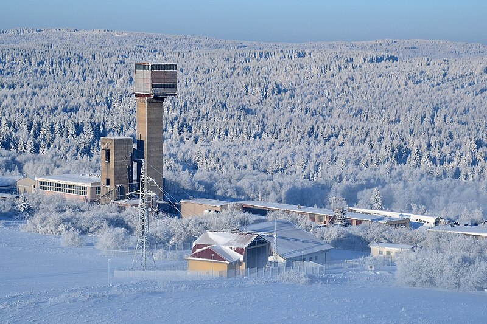
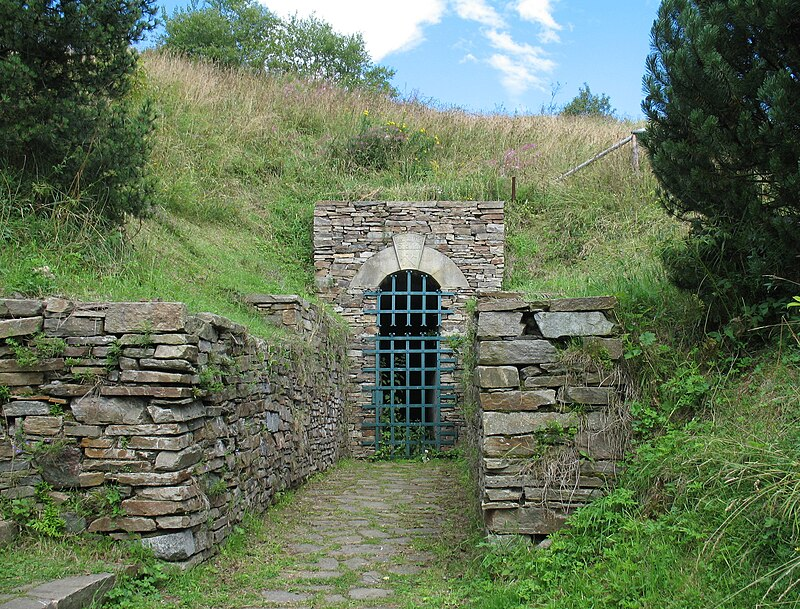

# Měděnec / Kupferberg — měď, magnetit, granáty

**Souhrn**: Hornické městečko v Krušných horách (okres Chomutov, Ústecký kraj) s tradicí těžby od přelomu 12. a 13. století — nejprve stříbro, pak měď (Kupferberg = „měděná hora") a vitriolové suroviny (pyrit, chalkopyrit), ve 20. století magnetit a granáty. Důl Měděnec byl posledním místem v Československu, kde se těžila železná ruda.
**Zdroje**: cs.wikipedia.org/wiki/Měděnec
**Poslední aktualizace**: 2026-05-09

---

*Důl Měděnec — těžní věž bývalého magnetitového dolu / Wikimedia Commons (CC BY-SA).*

*Štola Marie Pomocné, jedna ze dvou dědičných štol Mědníku, zpřístupněna turistům již roku 1910 / Wikimedia Commons (CC BY-SA).*

## Lokality (ČR)
- **Měděnec** (vrch Mědník, 910 m n. m., Krušné hory) — historické důlní pole s více než 80 dochovanými důlními díly.
- **Horní Halže** (místní část Měděnce) — vitriolová huť 1540–1860 zpracovávající měděnecký pyrit a chalkopyrit na zelenou a modrou skalici (Fe a Cu sulfáty).
- **Štola Marie Pomocné** — dědičná odvodňovací štola, zpřístupněna pro turisty 1910.
- **Štola Boží tělo** (Grenmühl) — druhá dědičná štola, dnes využívána jako zdroj pitné vody.

## Geologické prostředí
Měděnecké ložisko leží ve **východním krušnohorském krystaliniku** — mineralizované zóny v rulách a slídových břidlicích na styku s permokarbonskými sedimenty. Hlavní rudní druhy:

- **Magnetit** (Fe₃O₄) — masivní ložisko v hloubce, hlavní ekonomická surovina ve 20. století.
- **Chalkopyrit** (CuFeS₂) a **pyrit** (FeS₂) — primární zdroj mědi a vitriolových surovin v 16.–19. století.
- **Stříbro** v doprovodných žilách — ekonomicky vyčerpáno již ve 16. století.
- **Granáty** (almandin) a **slídy** — těženy 1992–1997 jako poslední fáze provozu Dolu Měděnec.
- Doprovodně **arzenopyrit** a malé množství stříbrných minerálů v původních žilách.

V padesátých letech 20. století zde proběhl uranový průzkum s negativními výsledky.

## Vzácnost
**Lokálně významný**, historicky cenný revír. Měděnec není zdrojem světově vzácných druhů, ale jako kombinace měděných, železných a granátových rud má v české hornické historii unikátní postavení — magnetit z Měděnce byl v letech 1968–1992 surovinou pro československou metalurgii a Důl Měděnec byl **posledním železorudným dolem v Československu**.

## Popis
Vznik osídlení doložen archeologickými nálezy pecí ze 13. století; první písemná zmínka o těžbě 1449. Vesnice oficiálně založena 1520 Hanušem z Fictumu. Roku **1588** povýšil Rudolf II. Měděnec na královské horní město podle **jáchymovského horního práva**. Třicetiletá válka revír těžce poznamenala (švédské vojsko vypálilo město 1640, mor 1633), těžba ale pokračovala s klesajícím výnosem.

V 18. a 19. století se těžil hlouběji uložený magnetit a Horní Halže v letech 1540–1860 vyráběla skalice (FeSO₄·7H₂O zelená, CuSO₄·5H₂O modrá) zpracováním sulfidové rudy. Po útlumu klasické těžby se měšťané živili paličkovanou krajkou, výrobou pleteného zboží a prýmků.

Moderní fáze: **1968–1992** Důl Měděnec těžil ložisko magnetitu — poslední československý železorudný důl. **1992–1997** se zde dotěžovaly granáty a slídy. Po uzavření se z obce stalo turistické centrum (lyžařské tratě v Horní Halži, blízkost Klínovce).

Smutnou kapitolou je požár Ústavu sociální péče v noci z 1. na 2. listopadu **1984**, při kterém zahynulo 26 lidí — událost se stala námětem filmu *Requiem pro panenku*.

## Zdroje
- [Měděnec — česká Wikipedie](https://cs.wikipedia.org/wiki/M%C4%9Bd%C4%9Bnec) — (zdroj: wikipedia-cs)

## Související stránky
[[JachymovskeRudy]] [[Kasiterit]] [[Index]]
