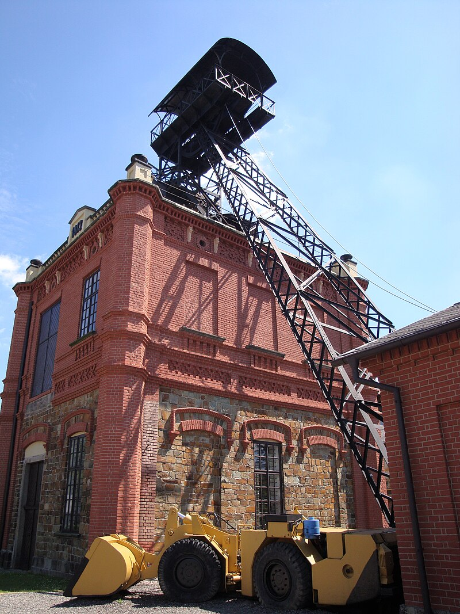
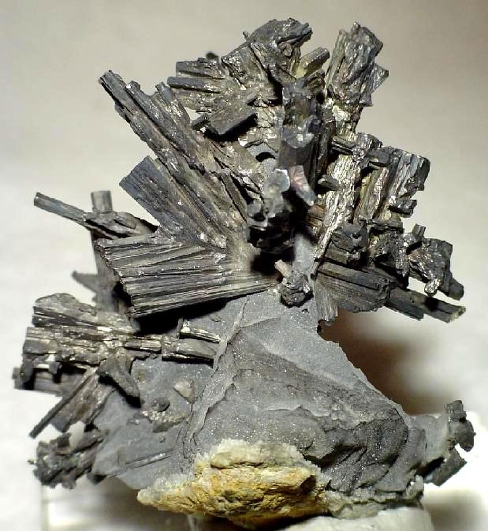

# Příbram — stříbrno-uranový revír

**Souhrn**: Druhý velký český stříbrný revír (po Kutné Hoře) — v 18. století nejvýnosnější stříbrné doly habsburské monarchie. V 19. stol. zde byla v důlním poli Březové Hory poprvé na světě překonána hloubka 1000 m. Ve 20. stol. (1949–1991) revír proslul těžbou uranu pod správou komunistického režimu, včetně pracovních táborů.
**Zdroje**: en.wikipedia.org/wiki/Příbram, en.wikipedia.org/wiki/Březové_Hory
**Poslední aktualizace**: 2026-05-09

---

*Ševčínský důl, Březové Hory — dřevěná těžní věž, dnes součást Hornického muzea Příbram / Wikimedia Commons (CC BY-SA).*

*Dyskrazit (Ag₃Sb) — typický minerál příbramských stříbrných žil / Wikimedia Commons (CC BY-SA, vzorek Hornické muzeum Příbram).*

## Lokality (ČR)
- **Březové Hory** (Příbram VI) — historické důlní pole se Ševčínským, Vojtěšským, Anenským, Mariánským a Prokopským dolem.
- **Vojtěšský důl** — roku 1875 zde dosaženo jako na první šachtě světa hloubky 1000 m.
- **Bytíz / Brod / Vojna** — uranové doly a pracovní tábory politických vězňů (1949–1951).
- **Hornické muzeum Příbram** (od 1953, dnes největší hornické muzeum v ČR).
- **Litavka** — kontaminační stopa po těžbě a hutnictví v jižním podbrdsku.

## Geologické prostředí
Příbramské žíly patří ke dvěma odlišným ložiskovým typům:

1. **Hydrotermální Pb-Ag-Sb-Zn žíly v proterozoiku Barrandienu** (žilný systém Březové Hory) — galenit (PbS) bohatý stříbrem, sfalerit, dyskrazit (Ag₃Sb), pyrargyrit (Ag₃SbS₃), stříbro ryzí. Klasický rudný typ rudních žil v ostrohorních paleozoických břidlicích a vulkanitech.
2. **Uranové žíly příbramsko-bytízského revíru** — uraninit (UO₂) s coffinitem a doprovodnými Bi-Co-Ni minerály v žilách prorážejících proterozoikum a paleozoikum jižně od Příbrami.

## Vzácnost
**Světová třída** (historicky). Příbram patří mezi nejvýznamnější Pb-Ag-Sb ložiska Evropy a zároveň k největším evropským uranovým revírům 20. století. Některé minerály (zejména dyskrazit, dříve i stefanit a pyrargyrit) jsou v muzejní kvalitě sběratelsky vyhledávané.

## Popis
První zmínka 1216 (Hroznata z Teplé prodal Příbram pražskému biskupství). Stříbrná těžba se rozjíždí v 16. stol., v roce 1579 povýšil Rudolf II. Příbram na královské horní město. Po útlumu během třicetileté války se v 18. stol. revír stává **nejvýnosnějším stříbrným ložiskem habsburské monarchie**, v polovině 19. stol. zde vzniká báňská akademie. Roku 1875 dosáhl Vojtěšský důl jako **první šachta na světě hloubky 1000 m** — oslavováno jako technický milník dobového hornictví. Březové Hory byly povýšeny na královské horní město 1897, s Příbramí spojeny 1953.

Po objevu uranu se v 50. letech 20. století otevřely doly na Bytízu, Brodu a Vojně — práce probíhala částečně formou nucených prací politických vězňů (tábory Příbram-Vojna a Příbram-Brody, 1949–1951, až 800 internovaných). Uranová těžba pokračovala až do 90. let; po roce 1989 byly všechny doly postupně uzavřeny a převedeny pod státní podnik Diamo (Správa uranových ložisek).

Příbramské vzorky **dyskrazitu** (Ag₃Sb, stříbřitá kovová masa s charakteristickým antimonovým leskem) patří k nejlepším světovým ukázkám tohoto vzácného antimonidu stříbra.

## Zdroje
- [Příbram — Wikipedia](https://en.wikipedia.org/wiki/P%C5%99%C3%ADbram) — (zdroj: wikipedia-en)

## Související stránky
[[KutnaHora]] [[JachymovskeRudy]] [[Index]]
