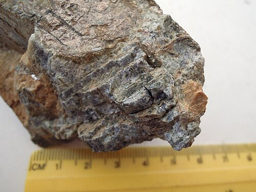

# Sekaninait / Sekaninaite

**Souhrn**: Železem bohatý analog cordieritu, modrofialový cyklosilikát poprvé popsaný roku 1968 z pegmatitů Dolních Borů na Vysočině. Pojmenován po českém mineralogovi Josefu Sekaninovi (1901–1986).
**Zdroje**: en.wikipedia.org/wiki/Sekaninaite
**Poslední aktualizace**: 2026-05-09

---

*Sekaninait (skupina cordieritu), Dolní Bory — Wikimedia Commons (CC)*

## Lokality (ČR)
- **Dolní Bory**, kraj Vysočina (okres Velké Meziříčí) — **typová lokalita** a dodnes nejvydatnější světový zdroj muzejně kvalitních vzorků. Známé pegmatity albitové zóny zde poskytly krystaly až ~70 cm.
- Mimo ČR: Brockley (Rathlin Island, Irsko), Japonsko, Švédsko — vesměs drobné výskyty.

## Geologické prostředí
Vzniká v **albitové zóně granitových pegmatitů** prorážejících granulity a ruly (Český masiv) a v pyrometamorfních horninách (paralavách, klinkerech, buchitech) jinde ve světě. V Dolních Borech jej doprovází K-živec (ortoklas, zde od 50. let těžený jako keramická surovina), křemen, skorylový turmalín a další pegmatitové minerály bohaté na železo.

## Vzácnost
**Světová třída — typová lokalita.** Globálně vzácný druh, Dolní Bory zůstávají referencí co do velikosti i kvality.

## Popis
(Fe²⁺,Mg)₂Al₄Si₅O₁₈, železitý člen řady cordierit–sekaninait. Kosočtverečný, prostorová grupa Cccm, tvrdost 7–7,5, skelný lesk, modrá až modrofialová barva s výrazným pleochroismem (X = bezbarvý, Y = modrý, Z = světle modrý). Krystaly jsou dipyramidální, ale obvykle špatně vyvinuté — většina vzorků z Dolních Borů je masivní, s jasně modrým jádrem a zonálními okraji bohatými na Fe. Druh objevili a popsali Staněk a Miškovský v roce 1968 (formálně publikováno 1975). Spolu s proslulým borským skorylem, berylem a topazem činí sekaninait z vysočinského pegmatitového pole jednu z nejdůležitějších českých mineralogických referenčních lokalit.

## Zdroje
- [Sekaninait — Wikipedie](https://en.wikipedia.org/wiki/Sekaninaite) — (zdroj: wikipedia-en)
- [Bobrůvka / Bory lokality — Drahékamenyonline](https://www.drahekamenyonline.cz/naleziste-a-lokality/) — (zdroj: drahekameny)

## Související stránky
[[Index]] [[Skoryl]] [[Zahneda]]
