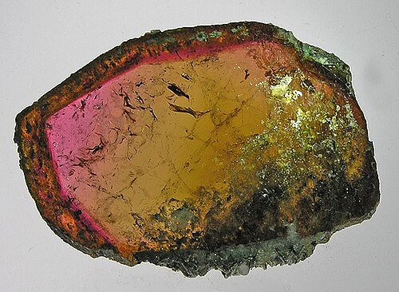

# Skoryl / Schorl (černý turmalín)

**Souhrn**: Železem bohatá smolně černá odrůda turmalínu. Standardní turmalín českých granitových pegmatitů; Dolní Bory patří ke globálně citovaným referenčním lokalitám a řada míst Vysočiny (Bobrůvka, Suky, Pikárec) poskytuje pěkné krystaly. Pikárec navíc dává lithiem bohatý rubelit.
**Zdroje**: en.wikipedia.org/wiki/Schorl, drahekamenyonline.cz/naleziste-a-lokality
**Poslední aktualizace**: 2026-05-09

---

*Krystal skorylu — Wikimedia Commons (CC)*

## Lokality (ČR)
- **Dolní Bory / Horní Bory** (Vysočina) — klasický pegmatit albitové zóny se skorylem až ~70 cm, doprovázeným [[Sekaninait]]em, berylem, topazem a ortoklasem (od 50. let těženým jako keramická surovina).
- **Suky** (Vysočina) — známé dutinami se záhnědou, morionem a skorylem, doprovázenými muskovitem, albitem a ortoklasem. Z povrchových nálezů pocházejí i drahokamově čisté citríny a křišťály.
- **Bobrůvka** (Vysočina, u Velkého Meziříčí) — řada pegmatitových lokalit.
- **Pikárec** („Špačkovka") — **lithiový pegmatit** poskytující **rubelit** (červený / růžový elbait) až několikacentimetrových rozměrů — jediná významná česká lokalita rubelitu.
- **Kněževes, Sklené nad Oslavou, Laštovičky, Rousměrov** — další pegmatitové lokality oblasti Žďár / Velké Meziříčí.

## Geologické prostředí
Vzniká v **granitových pegmatitech** Českého masivu (variský věk, ~330–290 mil. let). Skoryl je krajním železitým členem turmalínové skupiny: NaFe²⁺₃Al₆Si₆O₁₈(BO₃)₃(OH)₄. Krystalizuje v dutinách a srůstá s K-živcem, křemenem, slídou, berylem. Lithiem bohatá pikárecká žíla produkuje pozdními Li-bohatými fluidy elbait (rubelit) — výrazně odlišnou chemii.

## Vzácnost
**Lokálně hojný** pro skoryl (Vysočina je jedním z klíčových středoevropských pegmatitových pásů); **vzácný a sběratelské kvality** v případě pikáreckého rubelitu.

## Popis
Skoryl je trigonální, tvrdosti 7–7,5, sytě černý se skelným až polokovovým leskem, v tenkém průřezu silně pleochroický. Tvoří rýhované prizmatické krystaly, často protáhlé sloupce zakončené trojbokými jehlany. České vzorky se obvykle vyskytují jako černé jehlice a hranoly v dutinách pegmatitu vedle záhnědy a živce — klasická mineralogická estetika „černá na bílém". Skoryl je jedním z nejbohatších běžných silikátů na bor a klíčovým indikátorem pegmatitové geochemie. Pegmatitové pole Vysočiny v okolí Borů a Velkého Meziříčí zůstává jednou z nejdostupnějších klasických evropských skorylových lokalit.

## Zdroje
- [Schorl — Wikipedie](https://en.wikipedia.org/wiki/Schorl) — (zdroj: wikipedia-en)
- [Naleziště — Drahékamenyonline (Bobrůvka, Bory, Suky, Pikárec)](https://www.drahekamenyonline.cz/naleziste-a-lokality/) — (zdroj: drahekameny)

## Související stránky
[[Index]] [[Sekaninait]] [[Zahneda]]
