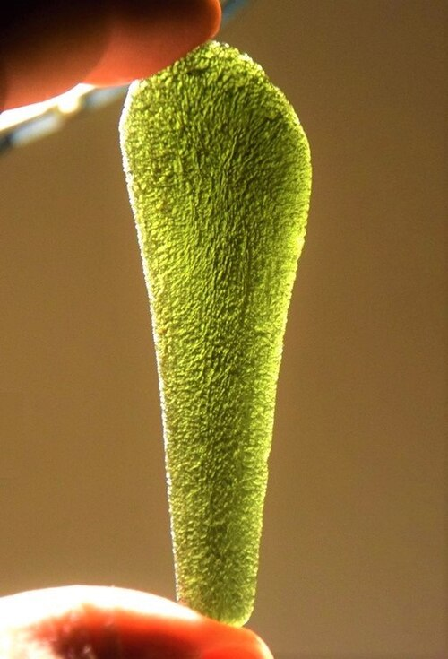
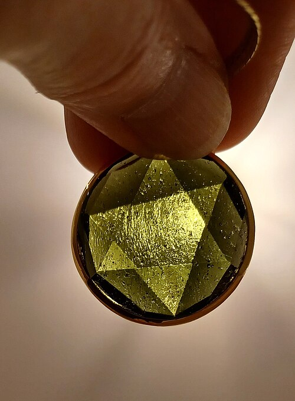

# Vltavín / Moldavite

**Souhrn**: Lesně zelený sklovitý tektit, který vznikl asi před 14,7 milionu let dopadem meteoritu na lokalitu Nördlinger Ries v jižním Německu. Hlavní světovou oblastí nálezů jsou jižní Čechy a jižní Morava — vltavín je proto nejikoničtějším drahým kamenem České republiky.
**Zdroje**: en.wikipedia.org/wiki/Moldavite, mineralexpert.org/article/moldavite-beautiful-czech-tektite
**Poslední aktualizace**: 2026-05-09

---

*Surový vltavín — Wikimedia Commons (CC)*

*Broušený vltavín — přívěsek — Wikimedia Commons (CC)*

## Lokality (ČR)
- **Jižní Čechy** (Českobudějovická a Třeboňská pánev) — hlavní rozptylové pole, nejvyšší kvalita. Lokality tvoří severozápadně–jihovýchodní pruh na západním okraji Českobudějovické pánve (vrábečské vrstvy, korosecké písčité štěrky). Týn nad Vltavou (něm. *Moldauthein*) je historickou typovou oblastí.
- **Jižní Morava** — oblast Třebíč–Znojmo–Brno; Slavice (nejstarší vltavínonosné sedimenty), Dukovany. Moravské kusy bývají v průměru větší, ale méně skulptované a často s nádechem do hněda.
- **Chebská pánev** (západní Čechy) — vzácné nálezy.
- Známé jmenovité lokality: Dobrkovská Lhotka („Paráz"), Nesměň, Krasejovka, Malý Chlum, Náchov.

## Geologické prostředí
Tektit — impaktní sklo, nikoli pravý minerál (žádná krystalová struktura, amorfní SiO₂ + Al₂O₃, ~65 % oxidu křemičitého). Vznikl jako roztavené kapky vyvržené z impaktního kráteru Nördlinger Ries (~24 km, Bavorsko), poté uložené 200–450 km na východ v miocenních píscích a štěrkopíscích. Původní uloženiny byly silně erodovány — dnes se vltavíny získávají z pískoven, štěrkoven a oraných polí, kde je vltavínonosná vrstva obnažena. České kusy mají charakteristickou hlubokou skulptaci — leptané jamky a rýhy způsobené dlouhým kontaktem s podzemní vodou bohatou na CO₂ a huminové kyseliny.

## Vzácnost
**Světová třída** — Česká republika je hlavním světovým zdrojem. Průměrná hmotnost vltavínu činí 6,7 g (české) až 13,5 g (moravské); největší moravský kus (Slavice) váží 265,5 g. Největší české vltavíny dosahují ~12 cm a ~150 g.

## Popis
Olivově zelené až lesně zelené (vzácněji hnědé — typické pro moravský materiál) průsvitné přírodní sklo se skelným leskem. Tvrdost dle Mohse 5,5–7. Měrná hmotnost 2,32–2,38, index lomu 1,48–1,54. Složení je převážně SiO₂ s Al₂O₃ a stopovými siderofilními prvky (Cr, Fe, Co, Ni). Od imitací se odlišuje červovitými inkluzemi lechatelieritu a šlírami protékání. Vědecky jej poprvé popsal v roce 1786 Josef Mayer (pražská univerzita) jako „chrysolity z Týna nad Vltavou"; název *moldavit* mu dal F. X. M. Zippe v roce 1836 podle řeky Vltavy (něm. Moldau). Vltavín využívali k výrobě nástrojů aurignacští lovci mladého paleolitu před 26 000–43 000 lety; v moderním šperkařství je to oblíbený polodrahokam — jeho kulturní status posilují ezoterické asociace hnutí New Age, což vyvolalo vlnu nelegální těžby v jihočeských lesích. Muzeum vltavínů sídlí v Českém Krumlově.

## Zdroje
- [Moldavit — Wikipedie](https://en.wikipedia.org/wiki/Moldavite) — (zdroj: wikipedia-en)
- [Moldavit — Mineralexpert.org](https://mineralexpert.org/article/moldavite-beautiful-czech-tektite) — (zdroj: mineralexpert)

## Související stránky
[[Index]] [[CeskyGranat]]
